<div align="center">


# 光衡 GuangHeng

### Autonomous Home Energy Agent  
### 自主家庭能源智能体

**持续理解家庭“发电—储能—用电—电网”的完整能量流，在真正值得行动时主动提出方案，获得授权后安全执行，并用真实设备回读与 Smart Meter 证明结果。**

[](https://flutter.dev/)
[](https://dart.dev/)


</div>

---

## 项目简介

传统家庭能源 App 主要负责展示数据。用户仍然需要自己查看光伏、家庭负载、电池 SOC、电价和天气，再决定什么时候充电、放电或调整负载。

光衡不是增加一块更复杂的 Dashboard，而是把家庭能源管理升级为完整闭环：

```text
持续观察
→ 预测变化
→ 主动判断
→ 生成方案
→ 用户授权
→ 安全执行
→ 设备回读
→ Smart Meter 验证家庭结果
```

没有必要动作时，系统保持安静；真正值得行动时，光衡才向用户解释原因、涉及设备和预计效果。

---

## 光衡解决什么问题

| 用户问题 | 光衡的解决方式 |
| --- | --- |
| 数据很多，但不知道下一步该做什么 | 综合光伏、负载、电池、电网、天气和策略，主动判断是否值得行动 |
| 只能看到现在，很难提前规划 | 使用未来光伏、负载与天气信息生成 24 小时计划 |
| 一个家庭目标往往涉及多台设备 | 使用 Action Set 把多个设备动作组合成一套方案 |
| AI 直接控制真实设备存在风险 | 将 AI 理解与设备执行权限分离，由 Backend 完成权限和安全检查 |
| 接口返回成功不代表家庭目标实现 | 通过命令确认、设备回读和 Smart Meter 家庭结果进行三级验证 |
| 设备控制路径复杂 | 支持 Flutter 深度管理与 Energy Companion 即时交互两个入口 |
| 历史数据只记录结果，无法解释原因 | 将决策、批准、执行、回读和验证放在同一时间线上 |

---

## 核心功能

### 1. 家庭能源 Autopilot

光衡持续读取家庭能源状态，并结合：

- 当前光伏发电
- 家庭负载
- 电池 SOC
- 电网购电与反送
- 天气与未来光伏预测
- 未来负载趋势
- 用户选择的 SAVE / AUTO / BACKUP 策略

系统判断当前是否存在值得执行的能源机会。

具体目标值由确定性优化逻辑计算，保证结果可重复、受约束；Hermes 负责理解用户目标、解释原因和回答自然语言问题，不凭感觉生成设备功率。

---

### 2. 跨设备 Action Set

一个家庭能源目标通常需要多台设备协同完成。

例如“减少光伏反送”可能同时包含：

```text
Solarbank 提高充电功率
+
Smart Plug 开启柔性负载
+
Smart Meter 验证反送功率下降
```

光衡把这些动作组合成一个 Action Set：

- 用户只确认一次
- 系统逐项执行
- 每一步执行前重新检查设备状态、权限和安全边界
- 每一步完成后读取真实设备状态
- 任一步失败，立即停止后续动作
- 最后由 Smart Meter 验证家庭目标是否实现

---

### 3. 三级结果验证

光衡不会把“接口调用成功”直接当成目标完成。

| 层级 | 验证内容 |
| --- | --- |
| L1 命令确认 | 控制请求是否被系统和设备接受 |
| L2 设备确认 | 重新读取设备状态，确认设备是否达到目标值 |
| L3 家庭结果确认 | Smart Meter 是否测量到预期的购电、反送或峰值变化 |

只有设备动作完成，并且家庭能源结果符合预期，方案才会显示为：

```text
VERIFIED / 已验证
```

---

### 4. 光衡语音控制

用户可以直接说出自己的目标，而不需要寻找设备菜单。

例如：

```text
“我现在家里的能源情况怎么样？”
“直接把备电改成 20%。”
“今晚多留一点电。”
“明天下雨，帮我提高备电。”
“现在光伏有余电，优先给电池充电。”
“停止热水器，优先给电池充电。”
```

语音控制遵守用户设置的权限：

| 控制级别 | 能力 |
| --- | --- |
| 观察模式 | 只能查询家庭能源状态 |
| 影子模式 | 可以分析和模拟，但不会修改设备 |
| 确认模式 | 生成待确认方案，用户确认后执行 |
| 完全访问 | 用户发出明确指令后，安全检查通过即可执行 |

如果指令不明确、设备离线、数据过期或目标超出安全范围，系统不会随意猜测，而是继续询问或拒绝执行。

---

### 5. 本地通知与即时交互

当出现待确认方案、执行结果或重要能源事件时，Flutter App 可以：

- 发送本地系统通知
- 播放提示音
- 显示桌面数字角标
- 点击通知进入对应方案
- 直接确认或暂不执行
- 将通知状态与 Backend 保持同步

通知链路使用本地通知能力，不依赖第三方推送平台。

---

## Flutter 产品页面

### 首页

首页负责让用户快速理解“现在发生了什么”：

- 家庭能源总览
- 光伏、家庭负载、电池和电网状态
- 3D 家庭能源视图
- 今日发电与用电
- 当前待确认方案
- 最近一次 Action Set 验证结果
- Smart Meter 家庭结果
- 本地通知入口

### 策略

策略页负责把能源优化变成可管理状态：

- SAVE / AUTO / BACKUP 策略
- 24 小时调度计划
- 电价、天气和负载信息
- 自治权限设置
- 跨设备协同方案
- 一次确认、分步执行
- Action Set 执行进度与验证结果

### 报表

报表页负责证明系统是否产生真实价值：

- 今日、本周、本月能源概览
- 总用电与电网购电
- 光伏自用率
- 参考基线与实际购电对比
- 节省趋势
- 决策与执行记录
- 日历购电支出
- 家庭能源韧性
- 批准、执行、回读与验证时间线

### 设备

设备页负责设备管理和能力查看：

- 动态设备发现
- Profile Catalog
- 家庭能源设备列表
- 设备健康诊断
- Home Assistant Area 家庭负载视图
- 储能实时数据与控制能力
- Smart Meter 分相与 CT 数据
- Smart Plug 功率、累计电量和开关控制
- MPPT / 光伏输入通道视图
- 关键负载配置
- 光衡 Energy Companion 配对与撤销授权
- BLE Wi-Fi 配网

---

## 系统架构

```mermaid
flowchart TB
    Flutter[光衡 Flutter App]
    Companion[ESP32-S3 Energy Companion]
    Backend[GuangHeng Backend]
    Hermes[Hermes AI]
    Optimizer[Deterministic Optimizer]
    HA[Home Assistant]
    Storage[Anker SOLIX 储能]
    Meter[Smart Meter Gen 2]
    Plug[Smart Plug Gen 2]

    Flutter -->|HTTPS| Backend
    Companion -->|HTTPS / WebSocket| Backend

    Backend --> Hermes
    Backend --> Optimizer
    Backend --> HA

    HA -->|本地 Modbus TCP| Storage
    HA -->|本地 Modbus TCP| Meter
    HA -->|本地 Modbus TCP| Plug

    Storage -->|状态回读| HA
    Plug -->|状态回读| HA
    Meter -->|家庭结果验证| HA
    HA --> Backend
    Backend --> Flutter
    Backend --> Companion
```



### 系统职责

| 系统 | 核心职责 |
| --- | --- |
| Flutter | 家庭能源总览、策略、权限、方案确认、设备管理、报表与验证 |
| GuangHeng Backend | 能源状态、方案管理、权限、安全检查、执行、回读与最终验证 |
| Hermes | 理解自然语言、识别目标、解释原因；不能绕过 Backend 直接写设备 |
| Deterministic Optimizer | 计算具体目标值、策略边界和硬约束 |
| Home Assistant | 设备接入、Entity、History 和经过允许的 Service Control |
| Smart Meter | 家庭能源真相来源和最终结果验证器 |
| ESP32-S3 Energy Companion | 可携带的提醒、查看、语音和长按授权入口 |

---

## 设备接入

光衡通过 Home Assistant 与 Anker SOLIX 官方集成读取和控制设备。

当前适配范围包括：

- Anker SOLIX Solarbank 4 E5000 Pro
- Anker SOLIX Solarbank Max AC
- Anker SOLIX Solarbank Max
- Anker SOLIX XE AC
- Anker SOLIX XE
- Anker SOLIX Smart Meter Gen 2
- Anker SOLIX Smart Plug Gen 2

上层业务不依赖写死的产品型号，而是根据设备真实暴露的能力运行：

```text
Device
+
Capability Set
+
Verification Status
```

主要能力类型包括：

```text
storage
meter
controllable_load
solar / mppt
```

设备支持情况仍取决于对应固件版本、Home Assistant 集成和实际暴露的 Entity。

Anker SOLIX 官方 Home Assistant 集成：

https://github.com/anker-charging/ha-anker-solix-official

---

## 24 小时可演示原型

以“减少光伏反送”为例：

1. Solarbank、Smart Meter 和 Smart Plug 接入 Home Assistant。
2. 中午出现明显光伏富余。
3. Smart Meter 检测到家庭正在向电网反送电力。
4. 光衡判断储能仍有可充空间，柔性负载也可以运行。
5. Flutter 出现“减少光伏反送”的跨设备方案。
6. 方案说明触发原因、参与设备、执行步骤和预期效果。
7. 用户在 Flutter 点击确认，或在 Energy Companion 上长按授权。
8. Backend 重新读取最新设备状态并完成权限、安全与目标边界检查。
9. 系统依次调整 Solarbank 和 Smart Plug。
10. 每个动作完成后重新读取真实设备状态。
11. Smart Meter 再次读取家庭电网功率。
12. 当实际反送功率下降并符合预期时，方案显示“已完成，结果已验证”。

```text
发现问题
→ 生成方案
→ 用户授权
→ 安全执行
→ 设备回读
→ Smart Meter 验证
→ VERIFIED
```

---

## Energy Companion

光衡 Energy Companion 使用：

```text
Waveshare ESP32-S3-Touch-AMOLED-1.8
+
ESP32-S3
+
ESP-IDF 5.5.5
```

它不是独立于 App 的另一套系统，而是与 Flutter 连接同一个 GuangHeng Backend，共享：

- 家庭能源状态
- 用户权限
- 待确认方案
- Action Set
- 执行进度
- 设备回读
- Smart Meter 验证结果

Flutter 已实现 Companion 管理入口：

- 输入设备屏幕上的 6 位配对码
- 确认配对
- 查看已授权终端
- 撤销授权
- 通过 BLE 配置 Wi-Fi
- 查看配网进度与错误信息

BLE 配网流程：

```text
Flutter
→ BLE 查找 GuangHeng Companion
→ 用户核对设备安全码
→ 发送 Wi-Fi SSID 和密码
→ ESP32-S3 写入本地存储
→ ESP32-S3 连接 Wi-Fi
→ 连接 GuangHeng Backend
```

Home Assistant 密钥和 AI 密钥不会通过 BLE 下发给终端。

> 本仓库主要包含 Flutter 客户端。ESP32-S3 固件和 Backend 属于光衡整体系统的其他工程。

---

## 数据来源

Flutter 不依赖手机保持前台来记录能源历史。

主要业务数据来自：

```text
Anker SOLIX 设备
→ Home Assistant
→ Recorder / History
→ GuangHeng Backend
→ Flutter
```

因此：

- App 关闭后，服务器仍可以持续采集和记录
- 今日、本周、本月报表由 Backend 历史数据聚合
- 决策与执行记录使用服务器时间并在 App 转换为本地时区
- 不可用字段不会简单显示为 `0`
- 设备离线、数据过期和能力缺失会显示真实状态

---

## 安全设计

### AI 与执行权限分离

Hermes 可以：

- 理解用户目标
- 解释为什么现在值得行动
- 回答家庭能源问题
- 形成待确认请求

Hermes 不可以：

- 绕过 Backend 审批
- 自行扩大用户权限
- 直接向 Home Assistant 写设备
- 在设备状态过期时强制执行

### 执行前检查

每次执行前，Backend 会检查：

- 用户控制权限
- 设备在线状态
- 数据是否有效
- 设备是否真实支持目标能力
- 目标值是否在安全范围内
- 用户确认后设备状态是否发生变化

### HTTPS

Flutter 正式环境通过 HTTPS 访问 Backend：

```text
https://43.155.204.194
```

开发环境可以通过 `GUANGHENG_API_BASE_URL` 覆盖。

---

## 当前工程状态

截至 2026-09-27：

| 项目 | 状态 |
| --- | --- |
| Flutter 首页 / 策略 / 报表 / 设备 | 已实现 |
| Android / iOS 工程 | 已配置 |
| Production HTTPS | 已接入 |
| 本地通知、提示音与桌面角标 | 已实现 |
| 通知点击交互 | 已实现 |
| 动态设备发现与 Profile Catalog | 已实现 |
| 家庭负载与关键负载配置 | 已实现 |
| Smart Meter 详细数据 | 已实现 |
| Smart Plug 控制入口 | 已实现 |
| 储能控制与状态回读 | 已实现 |
| 跨设备 Action Set | 已实现 |
| Smart Meter 家庭结果验证 | 已实现 |
| Companion 配对与撤销授权 | 已实现 |
| Flutter BLE Wi-Fi 配网 | 已实现 |
| `flutter analyze` | No issues found |
| Flutter 自动化测试 | 23 passed |

---

## 真实性边界

本项目区分以下证据状态：

| 状态 | 含义 |
| --- | --- |
| `SOFTWARE_IMPLEMENTED` | 软件功能已经实现 |
| `REAL_HIL` | 已连接真实硬件完成 Hardware-in-the-loop |
| `REAL_E2E` | 已完成真实端到端执行 |
| `VERIFIED` | 已通过回读或 Smart Meter 验证 |
| `SIMULATOR_E2E` | 使用共享家庭物理模型完成端到端验证 |
| `HIL_PENDING` | 软件已实现，但完整硬件链路仍待最终验收 |
| `PENDING_LONG_TERM` | 需要真实家庭长期运行数据 |

当前已经完成的主要工程闭环包括：

- Anker SOLIX 设备写入与回读
- 跨设备 Action Set 顺序执行与 Fail-stop
- Smart Meter 家庭结果验证
- Flutter 方案审批、执行进度和验证结果展示

以下内容不应被描述为已经完成长期验证：

- 长期节省金额
- 长期策略收益
- 预测准确率
- 大规模真实用户效果

当前“家庭能源韧性 6.2 小时”为展示估算值，不作为 Smart Meter 实测或长期效果证据。

---

## Flutter 工程结构

```text
lib/
├─ config/
│  └─ app_environment.dart
├─ core/
│  ├─ theme/
│  └─ utils/
├─ models/
│  ├─ backend_models.dart
│  └─ home_energy_data.dart
├─ repositories/
│  └─ backend_repository.dart
├─ services/
│  ├─ backend_api_client.dart
│  ├─ local_notification_service.dart
│  └─ companion_ble_provisioning_service.dart
├─ viewmodels/
│  ├─ backend_view_model.dart
│  └─ main_view_model.dart
└─ views/
   ├─ home/
   ├─ strategy/
   ├─ report/
   ├─ device/
   ├─ station/
   └─ shared/
```

---

## 本地运行

### 环境要求

推荐环境：

```text
Flutter 3.44.1
Dart 3.12.1
Android Studio / Android SDK
Xcode（仅 iOS 构建需要）
```

### 安装依赖

```bash
flutter pub get
```

### 运行静态检查

```bash
flutter analyze
```

### 运行测试

```bash
flutter test
```

### 使用本地 Backend

```bash
flutter run \
  --dart-define=GUANGHENG_API_BASE_URL=http://127.0.0.1:8000
```

Windows PowerShell：

```powershell
flutter run --dart-define=GUANGHENG_API_BASE_URL=http://127.0.0.1:8000
```

### 使用指定 HTTPS Backend

```bash
flutter run \
  --dart-define=GUANGHENG_API_BASE_URL=https://your-backend.example.com
```

---

## 构建

### Android Release

```bash
flutter build apk --release
```

或：

```bash
flutter build appbundle --release
```

### iOS Release

iOS 构建需要 macOS 与 Xcode：

```bash
flutter build ios --release
```

---

## 主要依赖

| 依赖 | 用途 |
| --- | --- |
| `provider` | 状态管理 |
| `http` | GuangHeng Backend HTTPS 请求 |
| `intl` | 日期、时间与本地化 |
| `flutter_local_notifications` | 本地通知与提示音 |
| `app_badge_plus` | App 桌面数字角标 |
| `shared_preferences` | 本地轻量状态 |
| `flutter_blue_plus` | Companion BLE 配网 |
| `model_viewer_plus` | 3D 家庭能源视图 |
| `table_calendar` | 报表日历 |
| `visibility_detector` | 页面可见性与图表动画 |

---

## Roadmap

- [x] Flutter 首页、策略、报表、设备四大入口
- [x] 家庭能源 Autopilot
- [x] 用户权限模型
- [x] 跨设备 Action Set
- [x] 设备状态回读
- [x] Smart Meter 家庭结果验证
- [x] 本地通知、声音与桌面角标
- [x] Companion 配对与 BLE 配网
- [x] 关键负载配置
- [x] MPPT / 光伏输入通道视图
- [ ] 真实家庭长期连续运行
- [ ] 长期节省效果评估
- [ ] 预测准确率评估
- [ ] ESP32-S3 语音全链路最终 HIL 验收
- [ ] 更多家庭与设备规模验证

---

## 项目定位

> 光衡不是把能源数据换一种方式展示，而是让系统持续理解家庭能源，在用户设定的权限范围内主动判断、协调设备执行，并用真实设备状态与 Smart Meter 证明最终结果。

```text
让家庭能源智能从“会说”走到“会做”，
从“会做”走到“有证据”。
```

---

## 相关链接

- 光衡 Flutter 仓库：  
  https://github.com/bandu111/guangheng

- Anker SOLIX 官方 Home Assistant 集成：  
  https://github.com/anker-charging/ha-anker-solix-official

- Flutter：  
  https://flutter.dev/

- Home Assistant：  
  https://www.home-assistant.io/

---

## 说明

本项目目前用于 Anker 黑客松原型展示与工程验证。

设备控制涉及真实家庭能源硬件。请仅在确认设备状态、控制权限、安全范围和网络环境后执行操作。